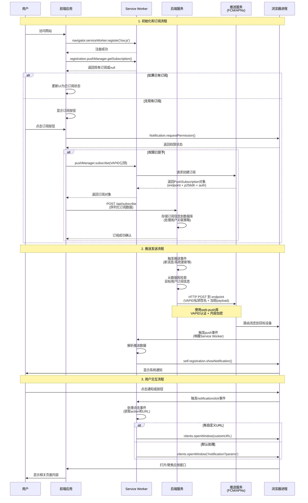

# 浏览器 Web Push 技术调研报告

本文档基于当前项目实践，深入分析和总结了浏览器 Web Push（网页推送）技术的实现、原理、限制和关键点。

## 1. 什么是浏览器推送？

浏览器推送是一种允许服务器在用户未打开网页的情况下，向其浏览器发送可点击通知的技术。即使用户的浏览器处于后台，甚至已经关闭，只要浏览器进程仍在运行，就能接收到通知。

其核心价值在于**提升用户召回率和参与度**。与移动应用推送（Native Push）类似，它为 Web 应用提供了一种有效的、低打扰的与用户重新建立连接的渠道。

## 2. 核心技术栈分析

Web Push 功能主要依赖以下 W3C 标准和技术组合：

1.  **Service Workers**: 一个在浏览器后台独立于网页运行的脚本。它是实现推送通知的基石，负责接收和处理来自服务器的 `push` 事件，并在用户界面上展示通知。

2.  **Push API**: 定义了 `PushManager` 接口，允许 Web 应用订阅推送服务，并获取一个唯一的 `PushSubscription` 对象。

3.  **Notifications API**: 允许 Service Worker 或网页脚本向用户显示系统级通知。

4.  **VAPID (Voluntary Application Server Identification)**: 一种安全标准，允许应用服务器向推送服务表明自己的身份，确保只有你的服务器才能向你的用户发送消息。它通过一对公私钥来工作。

5.  **推送服务 (Push Service)**: 由各浏览器厂商提供的中间服务，负责接收来自你服务器的推送请求，并将其高效地投递给对应的浏览器客户端。主要推送服务包括：
    - **Google FCM (Firebase Cloud Messaging)**: Chrome、Edge、Opera 浏览器在桌面和 Android 平台（在中国大陆无法访问）
    - **Mozilla AutoPush**: Firefox 浏览器在所有平台
    - **Apple Push Notification service (APNs)**: Safari 浏览器在 macOS 和 iOS/iPadOS；iOS/iPadOS 上的所有第三方浏览器（包括 Chrome、Firefox 等）也使用 APNs
    - **Microsoft WNS (Windows Notification Service)**: 早期 Edge Legacy，现已迁移到 FCM

    **重要说明**：由于 iOS 平台限制，所有浏览器（包括第三方浏览器）都使用 WebKit 内核和 APNs 服务，因此 iOS 上的 Chrome 实际依赖 APNs 而非 FCM。

    开发者无需关心各服务的内部实现差异，统一使用标准 Web Push API 即可。

## 3. 前后端数据流转过程

### 3.1 准备工作：生成 VAPID 密钥

在实现 Web Push 功能之前，首先需要生成 VAPID 公钥和私钥对。可以通过 `web-push` 包来生成：

```bash
npm install -g web-push
web-push generate-vapid-keys
```

执行后会输出类似以下格式的密钥对：

```
=======================================

Public Key:
BJ3QaWZ5YQ8pHW7_q2lJXN3pZ8Wq...（一个很长的Base64字符串）

Private Key:
7Gj2h8kN5qT3mZ7P1Q4wR6Y9...（另一个很长的Base64字符串）

=======================================
```

生成的公钥供前端订阅使用，私钥供后端发送推送使用。

### 3.2 数据流转流程



基于本项目的代码，完整的端到端数据流如下：

1.  **(前端) 注册 Service Worker 并检查现有订阅**:
    - 用户访问网站时，客户端 JavaScript 通过 `navigator.serviceWorker.register('/service-worker.js')` 注册 Service Worker。
    - 注册成功后，调用 `registration.pushManager.getSubscription()` 检查是否已有现有订阅。
    - 如果返回的订阅对象不为 null，说明用户之前已经订阅过，直接更新 UI 状态；如果为 null，则显示订阅按钮。

2.  **(前端) 请求权限与订阅**:
    - 在用户进行交互（如点击按钮）后，应用调用 `Notification.requestPermission()` 来请求用户授权。
    - 如果用户授权，应用通过 `navigator.serviceWorker.ready` 确保 Service Worker 激活，然后调用 `registration.pushManager.subscribe()`。此调用需要传入 VAPID 公钥，以验证应用服务器的身份。

3.  **(浏览器) 生成订阅对象**:
    - 浏览器接收到订阅请求后，会联系其内置的推送服务（如 Google 的 FCM）。
    - 推送服务为该用户和设备生成一个唯一的订阅端点（`endpoint` URL），并连同加密所需的公钥（`p256dh`）和认证密钥（`auth`）一起，打包成一个 `PushSubscription` 对象返回给前端。

4.  **(前端 -> 后端) 发送订阅信息**:
    - 前端将获取到的 `PushSubscription` 对象序列化（通常为 JSON 格式），并通过一个安全的 API 请求（如 `POST /api/subscribe`）发送到应用服务器。

5.  **(后端) 存储订阅信息**:
    - 应用服务器接收到订阅数据后，将其安全地存储在数据库中。
    - **用户关联策略**：需要考虑未登录用户的订阅场景：
      - **未登录订阅**：用户ID字段设为空（null），允许匿名用户订阅推送
      - **登录后绑定**：用户登录后，前端获取当前设备的订阅信息（endpoint），发送到后端与用户ID进行关联
      - **账号切换处理**：用户切换账号时，将当前设备的订阅记录的用户ID更新为新用户
      - **多设备管理**：一个用户可能有多个设备的订阅，需要支持一对多关系

6.  **(后端) 触发推送**:
    - 当有需要通知用户的新事件发生时（例如，新消息、系统更新），后端服务会从数据库中检索目标用户的有效订阅信息。

7.  **(后端 -> 推送服务) 发送通知**:
    - 后端使用一个 Web Push 库（如 `web-push` for Node.js），将通知内容（payload）和用户的 `PushSubscription` 对象打包。
    - 请求使用 VAPID 私钥进行签名，然后通过 HTTP POST 请求发送到 `PushSubscription` 中的 `endpoint` URL。

8.  **(推送服务 -> 浏览器)**: 浏览器厂商的推送服务接收到请求，验证签名后，将消息路由并投递到目标用户的设备和浏览器。

9.  **(浏览器 -> Service Worker) 唤醒并推送**:
    - 浏览器接收到消息后，即使网页已关闭，也会唤醒对应的 Service Worker，并触发一个 `push` 事件。
    - Service Worker 中的 `push` 事件监听器被执行，解析收到的数据，并调用 `self.registration.showNotification()` 来显示系统通知。

10. **(用户) 与通知交互**:
    - 当用户点击通知时，Service Worker 会捕获 `notificationclick` 事件。
    - 开发者可以在此事件监听器中定义交互行为，例如打开一个特定的 URL 或聚焦到已有的应用窗口，从而引导用户回到应用中。

## 4. 关键实现点与最佳实践

### 4.1 前端 (Client-Side)

- **环境检测与渐进增强**: 在尝试使用 Web Push 功能前，务必检查浏览器是否支持所需 API，以提供平稳的回退体验。

  ```javascript
  if ('serviceWorker' in navigator && 'PushManager' in window) {
    // 支持 Web Push
  } else {
    // 不支持 Web Push，可以隐藏相关功能或提示用户
  }
  ```

- **用户授权时机**: 避免在页面加载时立即请求通知权限，这通常会被用户拒绝。最佳实践是在用户执行了某个有价值的操作后，或在明确告知用户推送的好处后再请求。

- **完整的订阅流程**:
  1.  **注册 Service Worker**: `navigator.serviceWorker.register('/sw.js')`
  2.  **获取 Service Worker Registration**: `navigator.serviceWorker.ready`
  3.  **获取 PushManager**: `registration.pushManager`
  4.  **订阅**: `pushManager.subscribe({ userVisibleOnly: true, applicationServerKey: urlBase64ToUint8Array(VAPID_PUBLIC_KEY) })`

- **Service Worker 逻辑**:
  - **`push` 事件处理**: 在 `push` 事件监听器中，必须使用 `event.waitUntil()` 包裹异步操作（如 `self.registration.showNotification()`），以确保 Service Worker 在通知显示完成前不会被系统终止。
  - **`notificationclick` 事件处理**: 为通知添加交互性。通过检查 `event.action`，可以响应不同的按钮点击。使用 `clients.openWindow()` 或 `clients.matchAll()` 来控制浏览器窗口的打开和聚焦行为，提供更流畅的用户体验。

### 4.2 后端 (Server-Side)

- **VAPID 密钥管理**: VAPID 公钥是公开的，需要提供给前端。VAPID 私钥则必须严格保密，绝不能泄露到客户端。

- **订阅数据管理**:
  - **存储**: 必须将完整的 `PushSubscription` 对象（包含 `endpoint`, `keys.p256dh`, `keys.auth`）存储在数据库中。
  - **唯一性**: `endpoint` 是每个订阅的唯一标识。为避免重复存储和提高查询效率，可以将其哈希后作为主键或唯一索引。
  - **状态管理**: 增加一个 `isActive` 或类似的状态字段，用于标记订阅是否有效。

- **处理推送服务的响应**:
  - **订阅失效处理**: 当向推送服务发送消息时，必须检查其返回的 HTTP 状态码。如果收到 `410 Gone` 或 `404 Not Found`，意味着该订阅已失效（用户已取消授权或浏览器已卸载）。应立即从数据库中删除该订阅记录或将其标记为无效，以避免后续无效的推送尝试。
  - **重试机制**: 对于可恢复的错误（如 `429 Too Many Requests`），应实现带有指数退避策略的重试机制。

## 5. 使用场景

- **新闻与内容更新**: 媒体网站可以在发布重大新闻或用户关注的内容时推送通知。
- **电商通知**: 订单状态更新、物流跟踪、购物车商品降价、促销活动开始等。
- **社交与通讯**: 新消息、好友请求、@提及等。
- **SaaS 产品**: 重要任务提醒、报告生成完毕、系统状态变更等。
- **用户召回**: 对于长时间未访问的用户，发送提醒或优惠信息，引导其回归。

## 6. 限制与踩坑点

1.  **浏览器兼容性**:
    - 主流现代桌面浏览器（Chrome, Firefox, Edge）支持良好。
    - **Safari 支持情况**:
      - macOS Safari 16.1+ 完全支持标准 Web Push API，无需特殊适配。
      - iOS/iPadOS Safari 16.4+ 支持 Web Push，但用户必须先将网站"添加到主屏幕"（作为 PWA）并从主屏幕图标启动，才能使用推送功能。

2.  **中国国内网络问题**:
    - Web Push 依赖于浏览器厂商的推送服务，例如 Google 的 Firebase Cloud Messaging (FCM)。
    - FCM 在中国大陆地区通常**无法访问**，导致国内绝大多数 Chrome 用户无法接收到推送。这是在国内推广 Web Push 的一个**根本性障碍**。

3.  **用户授权门槛**:
    - 必须由用户**主动授权**，不能静默订阅。如果用户拒绝授权，就无法再次弹出授权框，除非用户手动去浏览器设置里修改。
    - **系统级通知权限**：除了网站级权限，还需要确保系统设置中允许浏览器显示通知。如果系统设置禁用了浏览器通知，即使网站获得授权也无法显示推送消息。
    - **最佳实践**: 不要在用户首次访问网站时就弹出请求，而应在用户完成某些有价值的操作后，或在明确告知用户推送的好处后再请求。

4.  **必须是 HTTPS**: 出于安全考虑，Service Worker 的注册和 Push API 的使用都强制要求网站必须运行在 `https://` 协议下（`localhost` 用于本地开发除外）。

5.  **订阅的非永久性**:
    - 用户的 `PushSubscription` 可能会在多种情况下失效，例如用户更换浏览器、清除网站数据、重装操作系统等。
    - 后端必须建立机制来处理推送服务返回的错误码（特别是 `410 Gone`），并及时清理无效的订阅记录。

## 7. 总结

Web Push 技术在技术上已经成熟，主要浏览器都已支持标准 API，对于希望在开放网络上建立用户粘性的应用来说，是一个有用的工具。

然而，其实际应用效果受到多方面限制：浏览器兼容性（iOS 需要 PWA 模式）、网络环境（FCM 在中国大陆无法访问）、用户授权意愿以及系统级通知权限设置等。在投入开发前，必须充分评估这些外部限制因素对目标用户群体的影响。

对于国内开发者而言，Firefox 和 Safari 用户能够正常接收推送，但占据主流的 Chrome 用户则无法使用此功能，这是推广 Web Push 的主要障碍。
